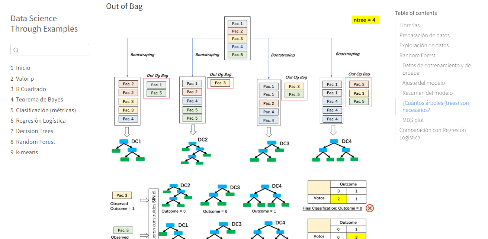
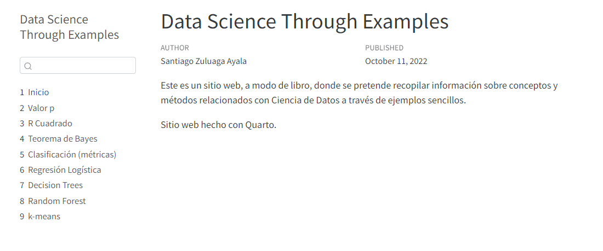

# DataScienceThroughExamples

| Sitio web: https://santiagozuluagaa.github.io/DataScienceThroughExamples/ |
| - |

La intención es compilar diferentes métodos conceptos y métodos de Data Science y explicarlos a través de ejemplos sencillos.

